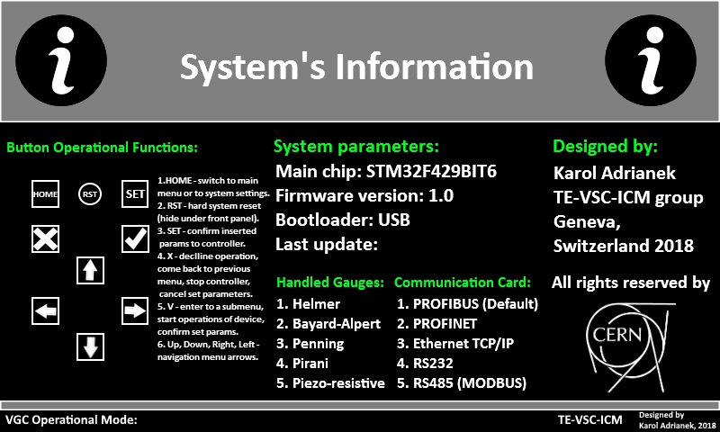

# Vacuum Gauges Controller (VGC) 2017 - 2018

The master thesis presents the design and the prototype of the new Vacuum Gauges Controller for high and ultra-high vacuum measurements for the Large Hadron Collider at CERN.

## Table of Contents
* [General Info](#general-info)
* [CERN Offical Document](#cern-official-document)
* [Hardware](#hardware)
  * [Electronics components](#electronics-components)
  * [Architecture](#architecture)
  * [Electronics Schematics](#electronics-schematics)
  * [PCB designs and 3D models](#PCB-designs-and-3D-models)
    * [Motherboard](#motherboard)
    * [Backplane board](#backplane-board)
* [Prototype](#prototype)
  * [Motherboard](#motherboard)
  * [Backplane board](#backplane-board)
  * [Final version](#final-version)
* [Software](#software)
  * [GUI templates](#gui-templates-(selected))
* [Author](#author)
* [Copyrights](#Copyrights)

## General Info

The graduate thesis has been performed in collaboration with CERN and AGH.

Main goals of this project were to design and prototype a new controller, which will be used to replaced out-of-date and obsoleted controllers (the TPG300 and the VGC1000), still in use at CERN.

Main tasks of the project were:
- designing, prototyping, soldering, and testing motherboard and backplane PCBs (Altium Designer 17),
- designing, coding, prototyping, implementing, testing, and debugging a firmware implementation for a STM32 microcontroller (C),
- designing and implementing GUI (Graphical User Interface),
- designing, coding, prototyping, implementing, testing and debugging a PC console application (C++11).

Practical part of this graduate project has been conducted from September 2017 up to September 2018 at CERN. Aims of this thesis were successfully fulfiled and the new controller has been physically made. 

The VGC prototype is operational and it supports vacuum gauges such as Helmer, Bayard-Alpert, Pirani, Penning and Piezo-resistive.

## CERN Official Document
The master thesis document is available on the CERN EDMS online service under [this link](https://edms.cern.ch/document/2082555/1).

## Hardware
Motherboard and backplane board schematics, 3D models and PCBs have been designed in Altium Designer 2017.

More details about hardware can be found in chapter 3 and chapter 4 of this [master thesis](./MasterThesis_Rev20_0__24_09_18_Final.pdf).

### Electronics components
- **`STM32F429BIT6`**: ARM Cortex-M4 main microcontroller
- **`5' TFT LCD MCT050TC12W800480LML`**: 800x480 
- **`256Mbit Micron SDRAM MT48LC16M16A2P`**: TFT LCD active data buffer
- **`64Mbit NOR FLASH S29GL064N90TFI040`**: non-volatile data buffer for storing GUI templates
- **`512Kbit EEPROM 24FC512`**: non-volatile data buffer for storing events timestamps, configuration and settings parameters
- **`L5972D`**: main power supply buck converter 24V/3.3V with 2A current limiter
- **`LT3466EDD`**: TFT LCD Backlight driver and boost converter
- **`TPS2500DRCR`**: USB power boost converter
- **`STF202-22T1G & NZF220TT1`**: USB OTG 2.0 ESD&EMI protection chips
- **`MAX6816`**: user buttons debouncer 
- **`SN74LVC2T45D & SN74LVC2G17D`**: Schmitt-trigger buffers for SPI buses

### Electronics Schematics
- [Motherboard](./schematics/vgc_motherbrd_schema.pdf) 
- [Backplane board](./schematics/vgc_backplanebrd_schema.pdf)

### PCB designs and 3D models

The motherboard is a four-layers PCB, where two layers are power supply layers (ground and +3.3VDC, placed on two internal layers of the PCB), and next two are signal layers (placed on external layers of the PCB).

The backplane board is a standard two-layer board with a boosted thickness of 3mm (due to requirements for high stiffness and more equalled distribution of mechanical stresses).

#### Motherboard

Top layers:

Bottom layers:

3D Model:

#### Backplane board

Design:

3D Model:

## Prototype

PCB boards have been made with the use of a solder oven and standard soldering tools.

Front panel design of the prototype has been designed in AutoCAD 2017. The front panel has been made with the use of a CNC milling machine.

Motherboard and the backplane boards are mounted in a standard 42HP 3U Europe Plug-in-Unit (manufactured by Schroff), fastened with M3 screws and standoffs.

More detailed photos of the prototype can be found in attachments of this [master thesis](./MasterThesis_Rev20_0__24_09_18_Final.pdf).

### Motherboard

### Backplane board

### Final VGC Controller

## Software
 
Firmware implementation for the main STM32 microcontroller has been written in **`C language`** in **`Atolic TrueStudio`** IDE.

Control console application has been written in **`C++11`** in **`Visual Studio Community 2017`** IDE.

Author of project has been not granted with a permission for publishing source files of firmware and console application.

More details about software can be found in chapter 6 of this [master thesis](./MasterThesis_Rev20_0__24_09_18_Final.pdf).

### GUI templates (selected)
Graphical User Interface (GUI) effects are generated by using designed GUI templates (stored as standard image formats), loaded to the external NOR and SDRAM memories. 

More details about GUI can be found in chapter 6.4 of the [master thesis](./MasterThesis_Rev20_0__24_09_18_Final.pdf).

  
  
  

  
  
  

  
  
  

## Author
- **Karol Adrianek**

## Copyrights
- The European Organization for Nuclear Research (CERN) in Geneve, Switzerland
- AGH University of Science and Technology in Cracow, Poland
