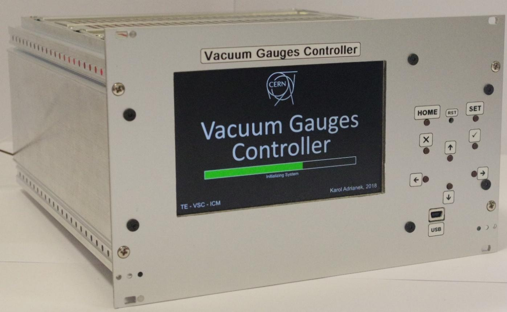

# Vacuum Gauges Controller (VGC) 2017 - 2018

The master thesis presents the design and the prototype of the new Vacuum Gauges Controller for high and ultra-high vacuum measurements for the Large Hadron Collider at CERN

## Table of Contents
* [General Info](#general-info)
* [CERN Offical Document](#cern-official-document)
* [Hardware](#hardware)
  * [Electronics components](#electronics-components)
  * [Architecture](#architecture)
  * [Electronics Schematics](#electronics-schematics)
  * [PCB designs and 3D models](#PCB-designs-and-3D-models)
    * [Motherboard](#motherboard)
    * [Backplane board](#backplane-board)
* [Software](#software)
* [Prototype](#prototype)
  * [Motherboard](#motherboard)
  * [Backplane board](#backplane-board)
  * [Final version](#final-version)
* [Author](#author)
* [Acknowledgments](#acknowledgments)
* [Copyrights](#Copyrights)

## General Info

The graduate thesis has been performed in collaboration with CERN and AGH.

The aims of this master project was to design and prototype the new controller, which will be replaced with the out-of-date and obsoleted controllers (the TPG300 and the VGC1000) still in use at CERN.

Author of project was responsible for:
- designing, prototyping and soldering the motherboard and backplane PCBs,
- designing and prototyping firmware implementation for STM32 main microcontrollers,
- designing and implementing GUI (Graphical User Interface),
- designing and implementing PC console application in C++.

The practical part of this graduate project has been conducted from September 2017 up to September 2018 at CERN. The aims of this thesis were fulfiled successfully and the controller has been psychically made. The VGC prototype is operational and can serve the vacuum gauges such as Helmer, Bayard-Alpert, Pirani, Penning and Piezo-resistive.

## CERN Official Document
The master thesis document is available to see on the CERN Documents Server under [this link](https://edms.cern.ch/document/2082555/1)

## Hardware
The motherboard and backplane schematics, 3D models and PCBs have been designed with the use of Altium Designer 2017.

Prototypes have been made manually with the use of standard solder station, PCB oven and 

### Electronics components
- **`STM32F429BIT6`**: ARM Cortex-M4 main microcontroller
- **`5' TFT LCD MCT050TC12W800480LML`**: 800x480 
- **`256Mbit Micron SDRAM MT48LC16M16A2P`**: TFT LCD active data buffer
- **`64Mbit NOR FLASH S29GL064N90TFI040`**: non-volatile data buffer for GUI templates
- **`512Kbit EEPROM 24FC512`**: non-volatile 
- **`L5972D`**: main power supply buck converter 24V/3.3V with 2A current limiter
- **`LT3466EDD`**: TFT LCD Backlight driver and boost converter
- **`TPS2500DRCR`**: USB power boost converter
- **`STF202-22T1G & NZF220TT1`**: USB OTG 2.0 ESD&EMI protection chips
- **`MAX6816`**: user buttons debouncer 
- **`SN74LVC2T45D & SN74LVC2G17D`**: Schmitt-trigger buffers for SPI buses

### Electronics Schematics
- [Motherboard](./schematics/vgc_motherbrd_schema.pdf) 
- [Backplane board](./schematics/vgc_backplanebrd_schema.pdf)

### PCB designs and 3D models

#### Motherboard

Top layers:

Bottom layers:

3D Model:

#### Backplane board

Design:

3D Model:

## Software
 
Firmware implementation for the STM32 main microcontroller has been written in C language in the **`Atolic TrueStudio`** IDE.

Console control application has been written in C++11 in the **`Visual Studio Code`** IDE.

Author of project has been not granted with a permission for publicing source codes of firmware and console application.

## Prototype

### Motherboard

### Backplane board

### Final VGC Controller

## Author
- **Karol Adrianek**: (gitlab:kadriane)

## Acknowledgments

## Copyrights
- The European Organization for Nuclear Research (CERN) in Geneve, Switzerland
- AGH University of Science and Technology in Cracow, Poland